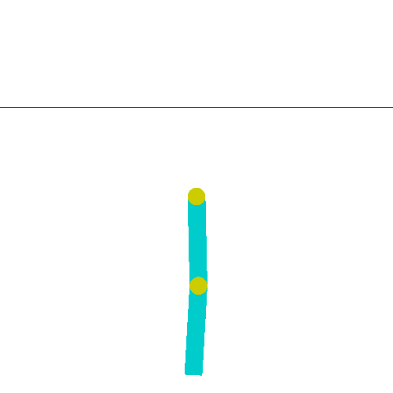
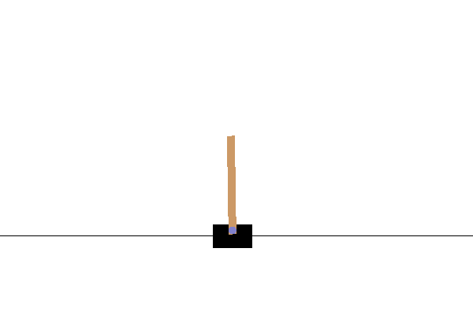
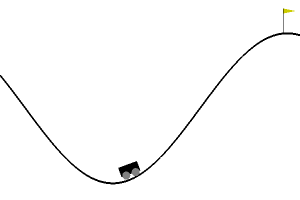
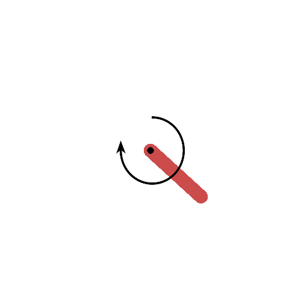

<H2>Heuristic solutions for classic control problems in OpenAI Gym</H2>

<a href="Acrobot.py">Acrobot-v1</a>: Swing up a two-link robot 
<a href="/slitvinov/gym/blob/main/CartPole.py">CartPole-v1</a>: Balance a pole on a cart 
<a href="/slitvinov/gym/blob/main/MountainCar.py">MountainCar-v0</a>: Drive up a big hill 
<a href="/slitvinov/gym/blob/main/Pendulum.py">Pendulum-v0</a>: Swing up a pendulum 
<a href="/slitvinov/gym/blob/main/MountainCarContinuous.py">MountainCarContinuous-v0</a>: Drive up a big hill with continuous control 

<PRE>
$ while python Acrobot.py; do :; done
-76.0
-75.0
-102.0
-80.0
-77.0
-103.0
-115.0
-75.0
-77.0
-75.0
  C-c
</PRE>

<PRE>
$ while python MountainCarContinuous.py ; do :; done
89.10000000000002
89.40000000000003
89.10000000000002
89.10000000000002
89.40000000000003
89.50000000000003
  C-c
</PRE>

<H2>Install</H2>
<PRE>
$ python -m pip install gym
</PRE>

<H2>References</H2>
<a href="https://gym.openai.com/envs/#classic_control">OpenAI gym documentation</a> 
<a href="https://github.com/openai/gym/wiki/Leaderboard">Leaderboard</a> 
